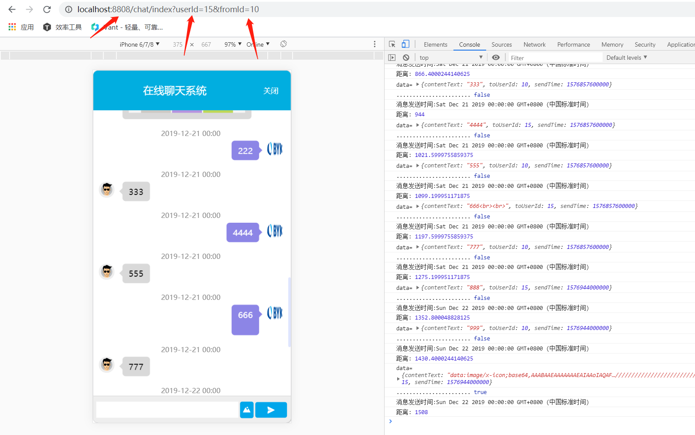
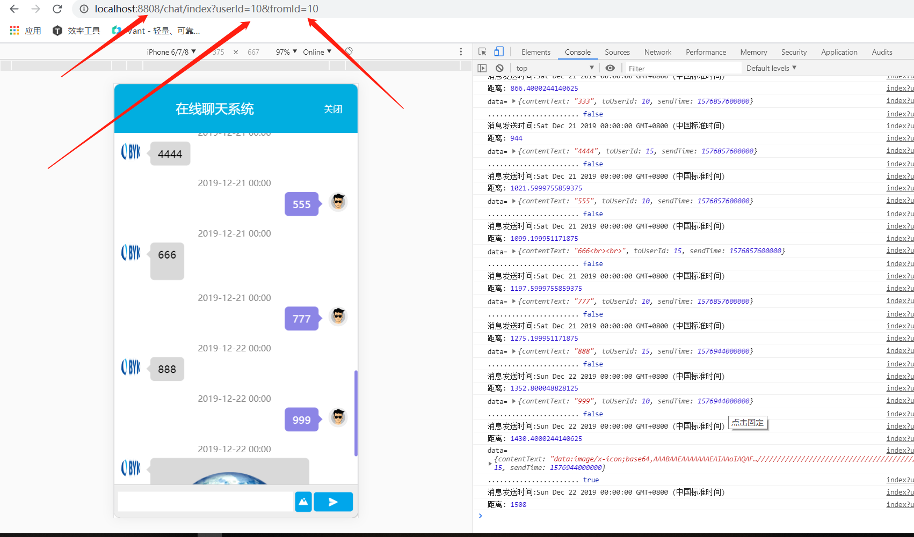

# websocket-online-chat
`基于springboot websocket mybatis thymeleaf mysql 的在线聊天工具(暂时只支持图片和文字)`

-----------------------

`页面效果:`

---------------------------

### `技术栈:`
* springboot
* mysql
* docker
* thymeleaf
* websocket
* mybatis

### `如何使用`
* 把db目录下面的sql导入本地数据库
* url中的两个参数userId和fromId是根据数据表dialogue_detail中的USER_ID和ID来确定的，如果dialogue_detail表中没有记录，则会连接失败
* 访问(`http://localhost:8808/chat/index?userId=10&fromId=10`)

-----------------------
