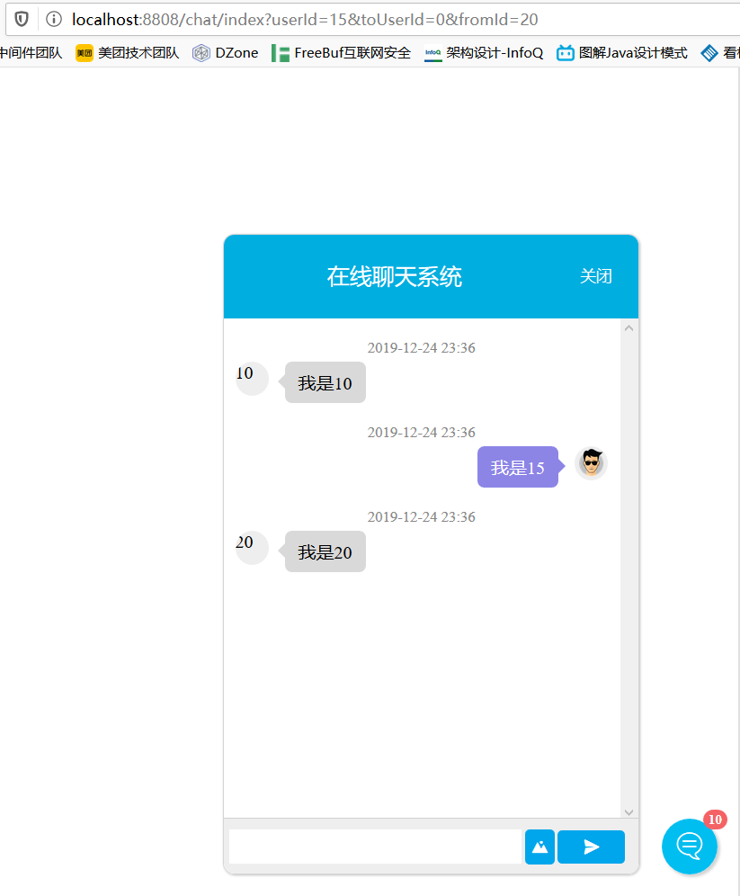

# websocket-online-chat
`基于springboot websocket mybatis thymeleaf mysql 的在线聊天工具(暂时只支持图片和文字)`

-----------------------

`页面效果:`
### 一对一聊天

### 群聊

---------------------------

### `技术栈:`
* springboot
* mysql
* docker
* thymeleaf
* websocket
* mybatis

## `如何使用`

### 群聊
* http://localhost:8808/chat/index?userId=10&toUserId=0&fromId=20
* http://localhost:8808/chat/index?userId=15&toUserId=0&fromId=20
* http://localhost:8808/chat/index?userId=20&toUserId=0&fromId=20

`fromId为频道ID，用户在一个频道下面才能进行聊天`
`在上面的基础上，userId=0则是往群聊发送信息`
`userId是当前用户的ID`

### 一对一聊天
* http://localhost:8808/chat/index?userId=20&toUserId=10&fromId=20
* http://localhost:8808/chat/index?userId=10&toUserId=20&fromId=20

`在上面的基础上，userId不为0则是往userId对方发送信息，这种是一对一的`

-----------------------
